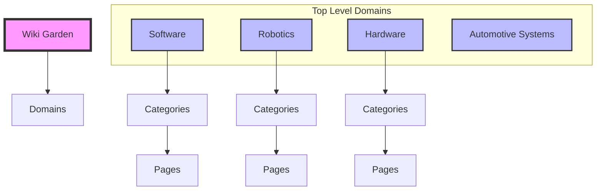

# Structured Knowledge Architecture

## Overview

This document outlines the revised architecture for the Wiki Garden, prioritizing **clear structure**, **strict hierarchy**, and **predictable navigation** over organic cross-linking. The goal is to create a clean, organized repository of knowledge.

## Core Principles

1.  **Strict Hierarchy**: Content is organized in a clear Tree structure. Every page has exactly one primary parent.
2.  **Clear Categorization**: Domains are distinct. Overlaps are handled via clear "Interface" pages or distinct "Related Topics" sections, not inline weaving.
3.  **Predictable Navigation**: Users should always know where they are in the tree. Navigation flows up and down the hierarchy.

## Architecture Visualization

## Implementation Guidelines

### 1. Page Structure
Standardize all pages to follow a clean layout:

*   **Header**: Title and Metadata.
*   **Overview**: Brief description of the domain/topic.
*   **Sub-Categories**: Clear list of child pages/folders.
*   **Resources**: External links and references.

### 2. Navigation Rules
*   **Primary Navigation**: Parent -> Child links.
*   **No Inline Cross-Links**: Avoid cluttering lists with `(See also: ...)` links.
*   **Dedicated "Related" Section**: If cross-referencing is absolutely necessary, place it in a distinct "Related Topics" section at the bottom of the page, clearly separated from the core content.

### 3. Domain Boundaries
*   **Software**: Pure software topics (Languages, Frameworks).
*   **Robotics**: Integrated systems. If a topic is purely software (e.g., Computer Vision algorithms), it lives in Software. If it's applied (e.g., Vision for Robots), it lives in Robotics.
*   **Hardware**: Physical components.

## Action Plan

1.  **Clean Up**: Remove inline `(See also: ...)` links added in the previous step.
2.  **Standardize**: Ensure `Robotics`, `Automotive Systems`, and `Hardware` follow the strict hierarchy.
3.  **Verify**: Check that the structure is clean and not "entangled".
