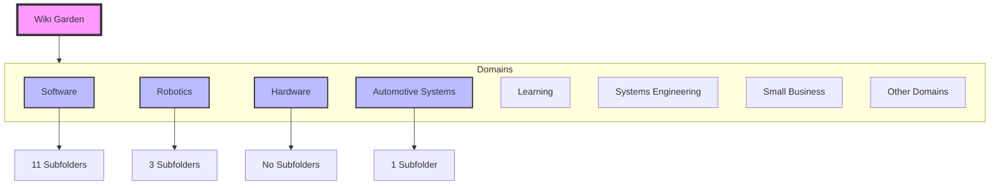
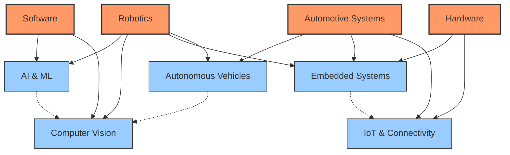

# Web of Knowledge Architecture

## Overview

This document outlines the architecture of the Wiki Garden, visualizing the "Web of Knowledge" and establishing patterns for cross-linking and content organization.

## Current Structure Analysis

The wiki is currently organized into 17 top-level domains under `/pages`. The structure is primarily hierarchical, but we are moving towards a networked "web" structure.

### Top-Level Domains

## The Web of Knowledge

The goal is to transform the hierarchical folder structure into a connected graph where related concepts are linked across domain boundaries.

### Key Interconnections

We have identified several key intersection points where domains overlap:

1.  **Robotics ↔ Software**
    *   *Intersection:* ROS/ROS2, Computer Vision, AI/ML, Embedded Software
    *   *Links:* `[[Robotics/ROS]]` <-> `[[Software/Programming]]`, `[[Software/Machine Learning]]`

2.  **Robotics ↔ Hardware**
    *   *Intersection:* Sensors, Actuators, Microcontrollers, Embedded Systems
    *   *Links:* `[[Hardware/Sensors]]` <-> `[[Robotics/Perception]]`, `[[Hardware/STM32]]` <-> `[[Robotics/Embedded]]`

3.  **Automotive ↔ Robotics**
    *   *Intersection:* Autonomous Vehicles, Path Planning, Lidar/Radar
    *   *Links:* `[[AutomotiveSystems/AutonomousVehicles]]` <-> `[[Robotics/Navigation]]`, `[[Robotics/Lidars]]`

4.  **Automotive ↔ Hardware**
    *   *Intersection:* CAN Bus, ECUs, Batteries
    *   *Links:* `[[Hardware/CAN]]` <-> `[[AutomotiveSystems/Vehicle Dynamics]]`

### Proposed Knowledge Graph

## Implementation Strategy

To realize this web, we will implement the following standard structure for all Domain and Sub-domain pages:

1.  **Frontmatter Metadata**:
    *   `type`: `[[Domain Name]]` (e.g., `[[Robotics]]`)
    *   `tags`: List of related domains (e.g., `tags: [Software, Hardware]`)

2.  **"Related Domains" Section**:
    *   Explicitly list and link to related top-level domains.
    *   *Example in Robotics:* "See also: [[Software]], [[Hardware]], [[Automotive Systems]]"

3.  **Contextual Cross-Linking**:
    *   In "Core Topics" lists, include relevant pages from other domains if they are tightly coupled.
    *   *Example in Hardware:* Under "Embedded Systems", link to `[[Robotics/ROS/Embedded ROS]]`.

## Domain Specific Plans

### Robotics
*   **Connect to Software:** Link ROS/ROS2 pages to C++/Python in Software.
*   **Connect to Hardware:** Link Components to specific Hardware pages (Motors -> Actuators).

### Automotive Systems
*   **Connect to Robotics:** Heavily link Autonomous Vehicles to Robotics algorithms (SLAM, Path Planning).
*   **Connect to Systems Engineering:** Link to Requirements and V-Model.

### Hardware
*   **Connect to Software:** Link Embedded Systems to Firmware/C programming.
*   **Connect to IoT:** Link Networking/Connectivity to Cloud Software.
